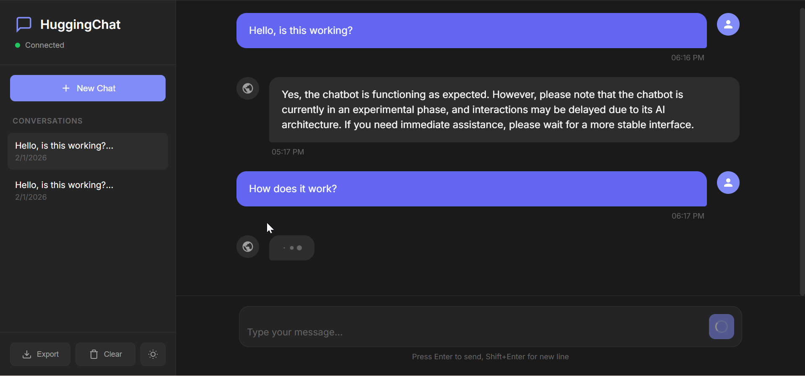

# HuggingChat - AI Chat Application



A chat application powered by a light Hugging Face language model, featuring a FastAPI backend and a modern React frontend.

   

## Quick Start

### Running with Docker

Start the entire application with a single command:

```bash
docker-compose up --build
```

The first run will download the AI model (~700MB), which may take a few minutes depending on your internet connection. Subsequent runs will use the cached model.

Once running:
- **Frontend**: http://localhost:3000
- **Backend API**: http://localhost:8000
- **API Documentation**: http://localhost:8000/docs

To stop the application:

```bash
docker-compose down
```

### Running Locally (Development)

#### Backend

1. Navigate to the backend directory:
```bash
cd backend
```

2. Create and activate a virtual environment:
```bash
python -m venv venv
source venv/bin/activate  # On Windows: venv\Scripts\activate
```

3. Install dependencies:
```bash
pip install -r requirements.txt
```

4. Start the server:
```bash
uvicorn app.main:app --reload --host 0.0.0.0 --port 8000
```

#### Frontend

1. Navigate to the frontend directory:
```bash
cd frontend
```

2. Install dependencies:
```bash
npm install
```

3. Start the development server:
```bash
npm run dev
```

## API Endpoints

| Endpoint | Method | Description |
|----------|--------|-------------|
| `/health` | GET | Health check and model status |
| `/chat` | POST | Send a message and receive a response |
| `/chat/history/{conversation_id}` | GET | Get conversation history |
| `/chat/clear/{conversation_id}` | POST | Clear a conversation |
| `/chat/conversations` | GET | List all active conversations |
| `/chat/regenerate/{conversation_id}` | POST | Regenerate the last response |

### Example API Usage

```bash
# Send a message
curl -X POST http://localhost:8000/chat \
  -H "Content-Type: application/json" \
  -d '{"message": "Hello! How are you?", "conversation_id": "my-chat"}'

# Get conversation history
curl http://localhost:8000/chat/history/my-chat

# Health check
curl http://localhost:8000/health
```

## License

This project is open source and available under the MIT License.

## Acknowledgments

- [Hugging Face](https://huggingface.co/) for the model and transformers library
- [SmolLM2](https://huggingface.co/HuggingFaceTB/SmolLM2-360M-Instruct) team for the efficient language model
